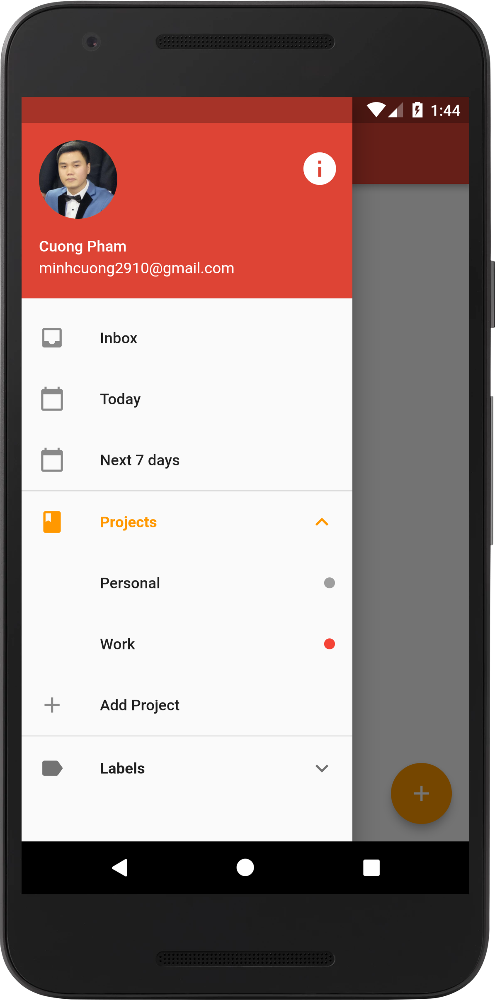
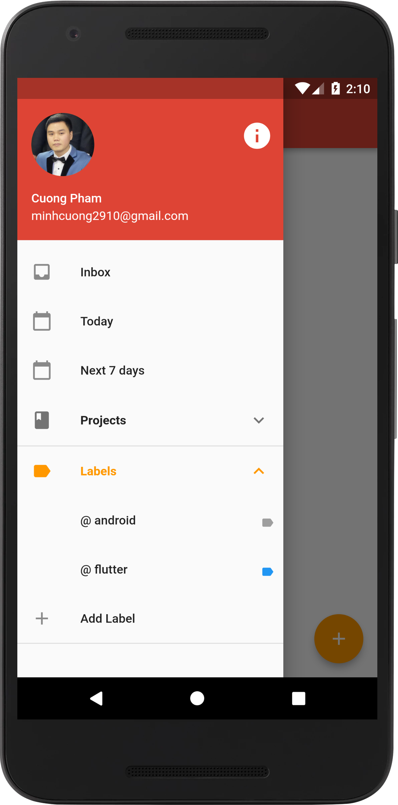
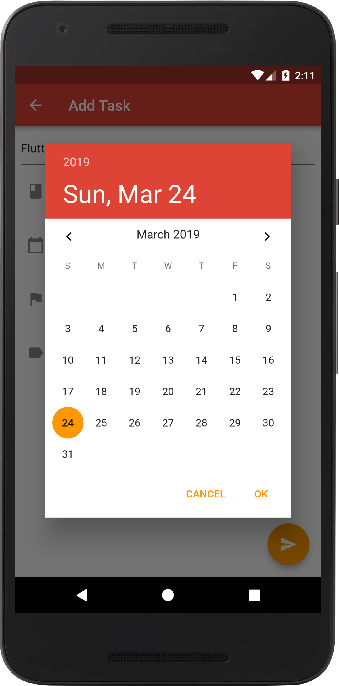
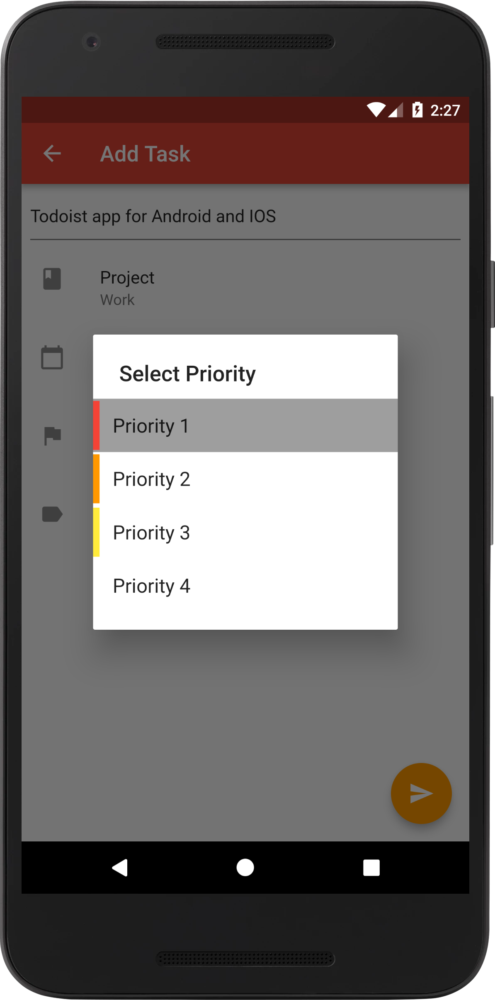
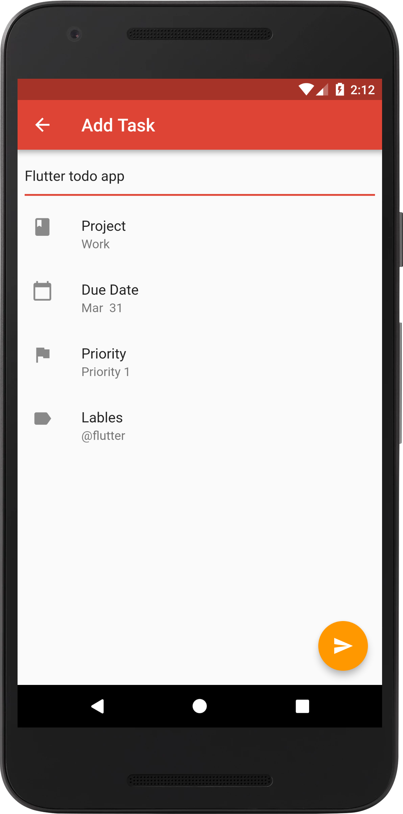
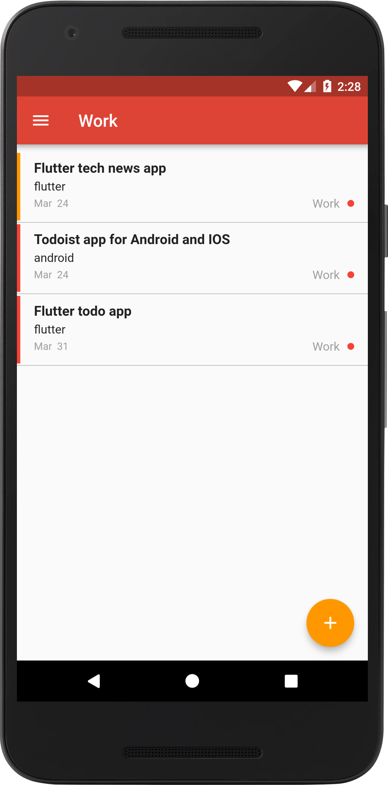
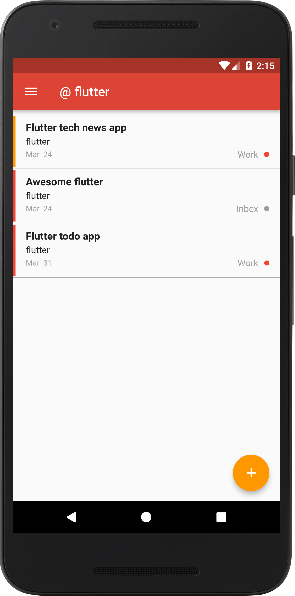
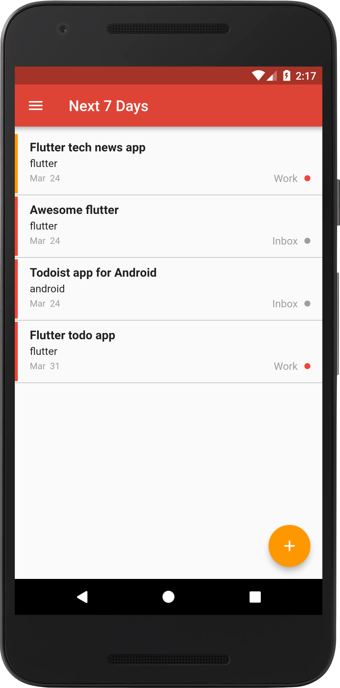

# FlutterTodo
🗒️📌 Play with Flutter by recreating Todoist app for Android and IOS.

## Features and tasks

- [x] Build project with BLoC architecture
- [x] Design data layer with Sqflite
- [x] Add projects
- [x] Add labels 
- [x] Add tasks
- [x] Sort tasks time, projects or labels
- [x] Swipe to complete or delete task
- [x] Edit tasks, projects, labels
- [x] Delete projects, labels
- [ ] Reminder with notification
- [ ] Write unit test

## Screenshots

       

## Credits

- [Todoist](https://twitter.com/todoist) app
- Flutter [Documentation](https://flutter.dev/docs)
- [WhatTodo](https://github.com/burhanrashid52/WhatTodo)

## License

This package is licensed under the MIT license. See [LICENSE](./LICENSE) for details.
